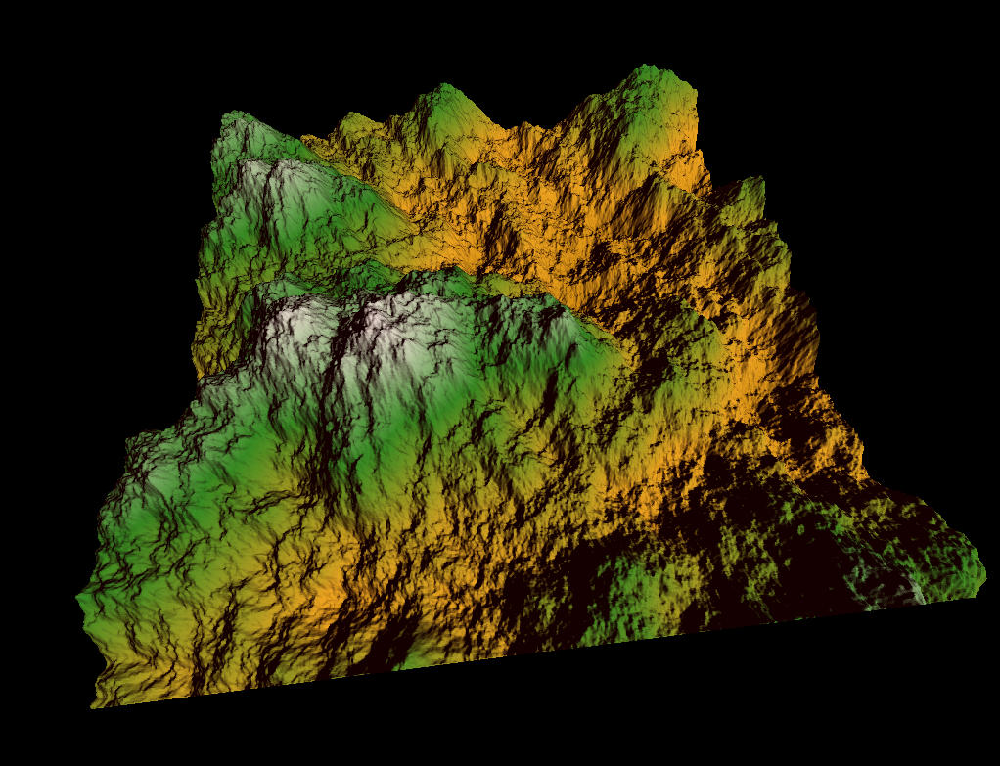

# Introduction to Computer Graphics: Project Report 1

## Part 1.1 - Height Map Generation
The height map generation is done in the `Init` function of `main.cpp` through
the `PerlinNoise` class.

### The `PerlinNoise` class
In the `Init` function, the class loads a vertex shader and a fragment shader.
Four vertices are created and passed to them, the coordinates buffer containing
values from *[0, 0]* to *[window_width, window_height]*.
Then a `GL_FRAMEBUFFER` is manually created (together with a `GL_TEXTURE_2D`) to store
height values using the `GL_R32F` internal format (format `GL_RED`, type `GL_FLOAT`).
Finally `Init` returns the id of the texture that will contain the height map.

`PerlinNoise` provides a `Compute` method which binds the framebuffer created as
described earlier, passes some variables (including the number of octaves to compute
the Fractal Brownian Motion) to the shaders and draws the height map
on the texture. Finally the framebuffer is unbound (`glBindFramebuffer(GL_FRAMEBUFFER, 0)`).

### Noise generation
Our implementation closely follows [***Improved Noise Reference implementation***](http://mrl.nyu.edu/~perlin/noise/).

We compute the permutation matrix (`p` in the reference) on CPU during the initialization
of `PerlinNoise` and pass it as an array of integers (`glUniform1iv`).

The rest of the code is in the fragment shader.
We were able simplify the code as we produce 2D noise: we only need two
values from `p` (`A` and `B`) and fewer interpolation calls.

To produce the *fBm* we call our `noise` function `octaves` times, multiplying each
time the coordinates with a frequency constant and multiplying the result by an amplitude
which varies at each iteration. The result of all iterations are summed to obtain the final
value of the height for the current pixel.

## Part 1.2 - Terrain Rendering
We adapted the code from previous homework to implement our grid. The length can be
changed at initialization. The code is encapsulated in the `Terrain` class.
The initialization function receives the id of the height map texture generated with
`PerlinNoise`, creates the vertices, indices and coordinates buffers as well as the model,
project and view matrices that it passes to the shaders. The class inherits from
`Material` and `Light` in order to implement the shading.

The colors are stored in `TEXTURE_1D` which is accessed with the height.

The shaders implement the shading computations as learned in the homework and give
height to the flat quad using the previously generated height map as a texture.

## Team Work
 - Vincenzo Bazzucchi worked on the height map generation and on the shading, for about 60%
 of the load.
 - Colin Branca worked the terrain rendering for the remaining 40%.
