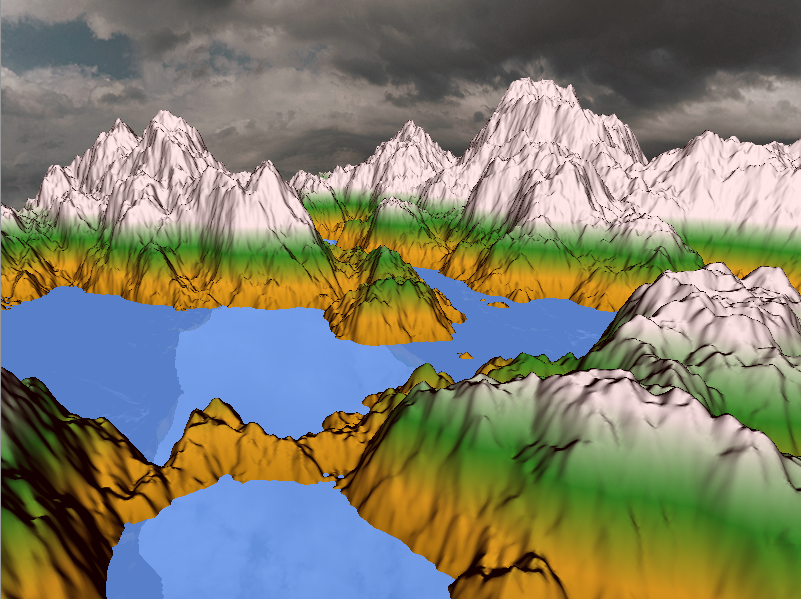

# Introduction to Computer Graphics: Project Report 2

## Part 2.1 - Improved Texturing
We didn't have the time to do this part for the moment. So this part will be discussed in the next report.

## Part 2.2 - Sky Modeling

We used some open source texture resources as our skybox.
The skybox itself is implemented with a cubemap: we have 6 different textures, one for each face of the cube,
that we combined together using the cubemap.
The size of the cube is then increased using a scaling matrix to simulate magnitude.

## Part 2.3 - Water Modeling
To model the water we created a new grid with the same dimensions as the terrain.
The water height is in a global value so that we can communicate it to other classes.
The height of the water can be changed by pressing `F1` and `F2`.
Concerning the reflexion of the water, we draw the terrain and the sky in a framebuffer with a new `view matrix` called `mirror_view`, calculated as follows:
>vec3 mirror_cam_pos = eye

>mirror_cam_pos.y = -mirror_cam_pos.y + 2*water_height

>mat4 mirror_view = LookAt(mirror_cam_pos, center, up)

## General Comments
We had trouble computing the water reflexion and we don't know, for the moment, how to fix it. This problem is the reason why we didn't finished what we had to to in this part.

## Team Work
 - Vincenzo Bazzucchi did some adjustments in the code and tried to fix the water reflexion: 30%.
 - Colin Branca worked on the water, tried to fix the reflexion and corrected some other problems:  40%.
 - Nicolas Phan Van did the skybox : 30%.
